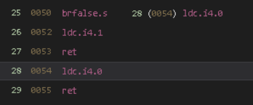

### TODO:
- [X] Add screenshots so this is not just a text file
- [ ] Prevent the app stopping updates when it gets too old

### What?
Attached is a patched APK that removes the root check of the SP mobile app.

### Why?/Background

I did this so that I could run this on my rooted phone running a degoogled LineageOS.

I found it strange that a relatively mundane app like this would even need to check for root. So, to get this running on my phone (and so that I could actually submit attendance codes, you need the damn app for that lol), I had to patch it.

This is a relatively simple thing to do, just a single patch, however it admittedly took me too long because I was stuck at a certain step for a long time. Couldn't figure out why the app keeps crashing and it was difficult for me to find it out because you can't really attach debuggers to android apps if you don't have the source code, unlike in computers where you could just step through the assembly in x86dbg or other tools. Perhaps there are Android specific ones, but I couldn't find any suitable ones, unforturtunately.

I eventually figured it out anyway, so everything's fine now (:

Anyway, below is the process of what exactly I did, including tools used, etc. Really learnt a lot from this, regarding Android Application Reverse Engineering. It's a quite a bit different and similar to reversing binaries on desktops at the same time :)

Note that this is NOT meant to be an instruction manual, this is simply a documentation of my exact thought processes throughout this.

### Stuff I did:

Firstly I used JADX gui (https://github.com/skylot/jadx) to open up the app and spent the next 3 days scrolling around the code uselessly trying the following couple of things:
- the string "We have detected that your mobile device is rooted/jailbroken".
- - Startup will emit this message, if phone is rooted, so I looked for this (See screenshot below)
- any function that relates to checking root or similar

I did find something related to the 2nd one (@sources\com\google\firebase\crashlytics\internal\common\CommonUtils.java -> isRooted()). I know this was probably not part of the actual SPMobile App itself, but I tried to trace its usages anyway, though I couldn't really find anything to the root checker. Nevertheless, I patched the smali for that for this function to always return false, but it did not work. 

And regarding the string "We have detected...", I tried to find it using the string searcher, but I did not see anything, so I thought, perhaps JADX was just faulty, so I reopened the decompile in VSCodium and searched. Also nothing.

But I keep seeing the word "Xamarin" popping up everywhere, so I looked it up, and I found out that the app was built with Xamarin, an application framework to run C# programs crossplatform.

Apparently, Xamarin packs its code into an assemblies.blob file as per this [article](https://thecobraden.com/posts/unpacking_xamarin_assembly_stores/). To extract, the article recommends that you use this python package called [pyxamstore](https://github.com/jakev/pyxamstore). 

After I decompiled the apk with apktool to get the assemblies.blob file, I got hold of pyxamstore and tried it.

But there was an error `No module named setuptools`. So I looked at the Github issues, and it seemed that other people were having it too, and the author seemed to have abandoned the project.

Luckily someone had an updated and fixed fork! Thank God for open source! (https://github.com/AbhiTheModder/pyxamstore)

Once I finally got the Xamarin unpacker working with `pyxamstore unpack -d ./unknown/assemblies/`. I crossed my fingers and dragged SPMobile.MAUI.dll into dnSpy and it seemed to have worked. I then looked for anything related to the root checker and found it:

Here is the corresponding IL bytecode:

Admittedly, I have no experience with C#, let alone CIL. But from checking out the Wikipedia IL opcode list and my own knowledge of x86 ASM, I knew exactly what to patch.

The entire function checks a bunch of conditions, all of which could be ignored then skipped to make the function always return false...and that's the desired behaviour since we want the function to act as if the phone has _not_ been rooted.

All you have to do is replace the first instruction with a `br` instruction (see prev screenshot), which seems to be analogous to an x86 `jmp`,to branch immediately to the "return false" part of the function at index 28 (see below screenshot)

^^CIL meaning 28-29: load an integer value of 1 (which is TRUE) and then return 

Once that's done, I repacked the code using`pyxamstore pack`

Recompiled the apk and tested it...and it crashed...below is part of the logcat output due to the crash:

Strange, perhaps my patch caused it to crash, so I retried again, except this time I did a relatively harmless patch of changing a single character of a random string...also crashed.

Maybe pyxamstore is not reliable? I unpacked and repacked the assemblies.blob file without patching anything but this time it worked. Strange.

But then I remembered there were some file with similar names to those unpacked from assemblies.blob, except they're in the format `libaout-*.dll.so`. Thus I made a hypothesis:

These are the generated AOT binaries from original compilation of the app, and the fact that the AOT and JIT binaries don't match causes the crash.

So how do I fix this? After searching online, I found out I could just simply [strip the AOT binaries](https://stackoverflow.com/questions/35966941/is-it-possible-to-remove-aot-assemblies-from-third-party-apk) from the app. I then ran `rm libaot-*.dll.so` for each of the architectures, did the antirootcheck patch, recompiled the APK with apktool and it didn't crash, at least in a virtual android machine which was not rooted.

I then tested it on my phone (which was rooted), and it worked! Finally its done!

